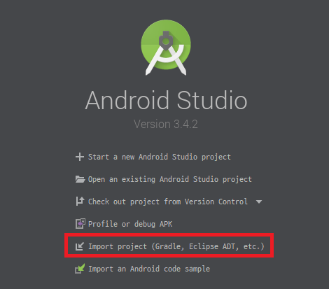

- 안드로이드 스튜디오를 설치합니다.

```
https://developer.android.com/studio/?hl=ko
```

- JDK를 설치합니다.

```url
https://www.oracle.com/technetwork/java/javase/downloads/jdk8-downloads-2133151.html
```

- PATH설정을 합니다.

```url
https://webnautes.tistory.com/1126
```

- 휴대폰에서 USB디버깅을 허용합니다.

```url
https://m.blog.naver.com/dsmobile3550/221299587135
```

- GIT 설치 후

```url
https://git-scm.com/download/win
```

- 하기의 명령어를 실행

```command
git clone https://github.com/khskeb0513/busanhsapp.git
```

- 이후 설정들을 필하고 아래 메뉴를 통해 프로젝트 임포트 가능.

